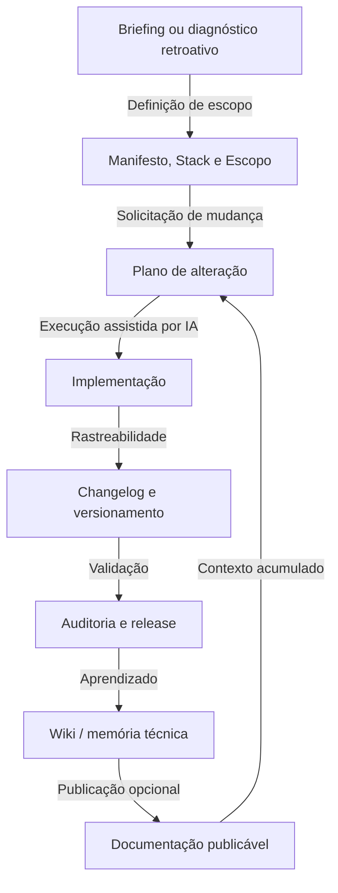
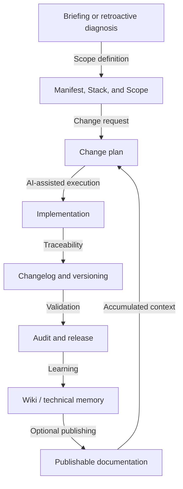

# FrameCode VibeWork Framework


Current framework version: `V0.7.8`

*Select Language / Selecione o Idioma:*
- [Português](#português)
- [English](#english)

---

## Português

**FrameCode VibeWork** é um framework de governança documental e técnica para desenvolvimento de aplicações assistido por IA. Ele organiza escopo, planos, changelogs, auditorias, troubleshooting, decisões arquiteturais, design system declarativo, governança de refatoração, habilidades de IA sob demanda e uma LLM Wiki mantida em Markdown.

O objetivo é reduzir perda de contexto entre sessões, impedir mudanças sem rastreabilidade e permitir que agentes de IA trabalhem em aplicações novas, avançadas ou legadas com regras claras.

### Estado Atual

- O framework é stack-agnostic e roda como documentação versionada em Markdown.
- A pasta `FCVW/` é a fonte canônica dos documentos, planos, changelogs, wiki, skills, templates e guias.
- A raiz do repositório-base existe para compatibilidade pública do GitHub e contém este README, `AGENTS.md` e arquivos ponte.
- `FCVW/docs/` contém a documentação publicável canônica e seus testes locais.
- `docs/` na raiz é mantida apenas por compatibilidade com GitHub Pages no repositório-base.
- `FCVW/refactoring-guide/` contém o guia operacional de refatoração com inventário, risco, testes, rollback, PR e critérios de parada.
- `FCVW/RETROACTIVE_INSTANTIATION.md` define a adoção retroativa do framework em aplicações já avançadas ou usando versões antigas do FCVW.
- `FCVW/FILESYSTEM.md` é a fonte de verdade para a árvore física completa.

### Como Funciona

O framework usa um ciclo explícito para garantir que mudanças sejam justificadas, planejadas, implementadas, validadas e registradas.



### Pilares

#### 1. Governança por planos

Nenhuma alteração funcional, visual, estrutural ou documental deve ser aplicada sem plano correspondente em `FCVW/Plans/`.

#### 2. Rastreabilidade por versão

Toda alteração em arquivo versionado deve ser registrada em `FCVW/changelogs/Vx.y.z.md` ou em fragmento de `FCVW/changelogs/unreleased/` até a publicação.

#### 3. Memória técnica incremental

A pasta `FCVW/wiki/` segue o padrão LLM Wiki: fontes brutas, páginas sintetizadas, índice, log, links internos, estados de confiança e sínteses de sessão AICC.

#### 4. Design system declarativo

`FCVW/DESIGN.md` centraliza tokens, regras visuais, contratos de componentes e critérios de experiência. Exemplos físicos devem ser gerados na aplicação instanciada quando necessários.

#### 5. Refatoração governada

`FCVW/REFACTORING.md`, `FCVW/refactoring-guide/` e os templates de refatoração em `FCVW/governance/` definem quando refatorar, como mapear risco, quais testes caracterizar e quando parar.

#### 6. Separação entre framework e aplicação

Templates genéricos ficam em `FCVW/governance/` e `FCVW/wiki/templates/`. Documentos preenchidos com dados reais da aplicação ficam nos documentos canônicos do projeto. A aplicação não deve misturar código de produto com regras reutilizáveis do framework.

#### 7. Instanciação nova e retroativa

`FCVW/INSTANTIATION.md` cobre projetos novos. `FCVW/RETROACTIVE_INSTANTIATION.md` cobre aplicações existentes, avançadas ou legadas, com defaults autônomos e não destrutivos para agentes de IA.

#### 8. Motor de Habilidades (ASE)

`FCVW/skills/` armazena procedimentos técnicos carregados sob demanda pelo agente de IA, nunca pré-carregados no prompt. Isso mantém baixo consumo de tokens e disponibiliza checklists especializados quando necessário.

Habilidades ativas: `agent-aegis`, `agent-hephaestus`, `agent-hermes`, `agnix-linter`, `aicc-compact`, `brainstorming-and-tdd`, `git-conventional-commits`, `memory-rotation`, `obsidian-markdown`, `orchestrator`, `project-instantiation`, `release-checklist`, `retroactive-instantiation`, `systematic-debugging`, `wiki-lint`.

### Estrutura Operacional Resumida

- `AGENTS.md`: ponto de entrada operacional para humanos e agentes.
- `FCVW/CONTEXT_MAP.md`: carregamento seletivo por tipo de sessão.
- `FCVW/BRIEFING.md`: Fase 0 e descoberta inicial.
- `FCVW/INSTANTIATION.md`: instanciação de novos projetos.
- `FCVW/RETROACTIVE_INSTANTIATION.md`: adoção retroativa em aplicações existentes.
- `FCVW/PLANNING.md`: metodologia obrigatória de planos.
- `FCVW/MANIFEST.md`, `FCVW/STACK.md`, `FCVW/SCOPE.md`: identidade, stack e limites do projeto.
- `FCVW/REFACTORING.md` e `FCVW/refactoring-guide/`: governança de refatoração.
- `FCVW/wiki/`: memória técnica, sessões AICC e conhecimento reutilizável.
- `FCVW/skills/`: habilidades JIT para agentes.
- `FCVW/FILESYSTEM.md`: árvore física completa e auditável.

### Consumo de Tokens por Cenário

As estimativas abaixo são referências de planejamento para reduzir custo de contexto em chamadas de LLMs. Recalibre após crescimento material dos documentos.

| Cenário Mapeado | Documentos Ingeridos | Custo Inicial (Sem AICC) | Custo por Turno com AICC | Economia com AICC |
| :--- | :--- | :---: | :---: | :---: |
| **Bugfix / Troubleshooting** | `AGENTS.md` + `TROUBLESHOOTING.md` + `PLANNING.md` | ~5.000 tokens | **~1.200 tokens** | **-76%** |
| **Nova Funcionalidade** | `AGENTS.md` + `SCOPE.md` + `PLANNING.md` + `DESIGN.md` | ~7.000 tokens | **~1.500 tokens** | **-78%** |
| **Componentes / UI** | `AGENTS.md` + `DESIGN.md` | ~4.000 tokens | **~900 tokens** | **-77%** |
| **Refatoração** | `AGENTS.md` + `REFACTORING.md` + `PLANNING.md` | ~8.000 tokens | **~1.800 tokens** | **-77%** |
| **Instanciação nova** | `AGENTS.md` + `INSTANTIATION.md` + `BRIEFING.md` + `MANIFEST.md` | ~8.500 tokens | **~2.000 tokens** | **-76%** |
| **Instanciação retroativa** | `AGENTS.md` + `RETROACTIVE_INSTANTIATION.md` + `skill:retroactive-instantiation` | ~7.500 tokens | **~1.900 tokens** | **-75%** |
| **Release** | `CONTEXT_MAP.md` + `skill:release-checklist` | ~2.500 tokens | **~600 tokens** | **-76%** |

### Como Usar

#### 1. Novo projeto

Clone o framework, leia `AGENTS.md`, carregue `FCVW/INSTANTIATION.md` e execute a Fase 0 em `FCVW/BRIEFING.md`.

```bash
git clone https://github.com/Sistema2D/FrameCode-VibeWork.git meu-projeto
cd meu-projeto
```

#### 2. Aplicação existente ou legado

Use `FCVW/RETROACTIVE_INSTANTIATION.md` e a skill `FCVW/skills/retroactive-instantiation/SKILL.md`. A IA deve preservar código, README, configuração, dados e histórico da aplicação, importando ou reparando o FCVW de forma não destrutiva.

#### 3. Refatoração de código

Use `FCVW/REFACTORING.md` e `FCVW/refactoring-guide/` antes de alterar arquitetura ou módulos existentes. Refatoração deve ser incremental, testável, reversível e governada por plano.

#### 4. Trabalho diário com IA

Peça ao agente para seguir `AGENTS.md`. Consultas, análises e revisões sem edição de arquivos não exigem plano. Qualquer alteração exige plano, changelog, validação e síntese de sessão quando aplicável.

---

## English

**FrameCode VibeWork** is a document-based and technical governance framework for AI-assisted application development. It organizes scope, plans, changelogs, audits, troubleshooting, architectural decisions, declarative design rules, refactoring governance, on-demand AI skills, and an LLM Wiki maintained in Markdown.

The goal is to reduce context loss between sessions, prevent untraceable changes, and let AI agents work in new, advanced, or legacy applications with clear rules.

### Current State

- The framework is stack-agnostic and runs as versioned Markdown documentation.
- `FCVW/` is the canonical source for documents, plans, changelogs, wiki, skills, templates, and guides.
- The baseline repository root exists for GitHub public compatibility and contains this README, `AGENTS.md`, and bridge files.
- `FCVW/docs/` contains the canonical publishable documentation and local tests.
- Root `docs/` is kept only for GitHub Pages compatibility in the baseline repository.
- `FCVW/refactoring-guide/` contains the operational refactoring guide with inventory, risk, tests, rollback, PR, and stopping criteria.
- `FCVW/RETROACTIVE_INSTANTIATION.md` defines retroactive framework adoption for advanced applications or projects using older FCVW versions.
- `FCVW/FILESYSTEM.md` is the source of truth for the complete physical tree.

### How It Works

The framework uses an explicit lifecycle to ensure that changes are justified, planned, implemented, validated, and recorded.



### Pillars

#### 1. Governance by Plans

No functional, visual, structural, or document change should be applied without a corresponding plan in `FCVW/Plans/`.

#### 2. Version Traceability

Every change in a versioned file must be recorded in `FCVW/changelogs/Vx.y.z.md` or as a fragment in `FCVW/changelogs/unreleased/` until publication.

#### 3. Incremental Technical Memory

`FCVW/wiki/` follows the LLM Wiki standard: raw sources, synthesized pages, index, log, internal links, confidence states, and AICC session syntheses.

#### 4. Declarative Design System

`FCVW/DESIGN.md` centralizes tokens, visual rules, component contracts, and experience criteria. Physical examples should be generated inside the instantiated application when needed.

#### 5. Governed Refactoring

`FCVW/REFACTORING.md`, `FCVW/refactoring-guide/`, and the refactoring templates in `FCVW/governance/` define when to refactor, how to map risk, which tests to characterize, and when to stop.

#### 6. Framework and Application Separation

Generic templates live in `FCVW/governance/` and `FCVW/wiki/templates/`. Documents filled with real application data live in the canonical project documents. The application should not mix product code with reusable framework rules.

#### 7. Fresh and Retroactive Instantiation

`FCVW/INSTANTIATION.md` covers fresh projects. `FCVW/RETROACTIVE_INSTANTIATION.md` covers existing, advanced, or legacy applications with autonomous and non-destructive defaults for AI agents.

#### 8. AI Skills Engine (ASE)

`FCVW/skills/` stores technical procedures loaded on demand by the AI agent, never pre-loaded into the prompt. This keeps token consumption low while making specialized checklists available when needed.

Active skills: `agent-aegis`, `agent-hephaestus`, `agent-hermes`, `agnix-linter`, `aicc-compact`, `brainstorming-and-tdd`, `git-conventional-commits`, `memory-rotation`, `obsidian-markdown`, `orchestrator`, `project-instantiation`, `release-checklist`, `retroactive-instantiation`, `systematic-debugging`, `wiki-lint`.

### Operational Structure

- `AGENTS.md`: operational entrypoint for humans and agents.
- `FCVW/CONTEXT_MAP.md`: selective loading by session type.
- `FCVW/BRIEFING.md`: Phase 0 and initial discovery.
- `FCVW/INSTANTIATION.md`: fresh project instantiation.
- `FCVW/RETROACTIVE_INSTANTIATION.md`: retroactive adoption in existing applications.
- `FCVW/PLANNING.md`: mandatory plan methodology.
- `FCVW/MANIFEST.md`, `FCVW/STACK.md`, `FCVW/SCOPE.md`: project identity, stack, and boundaries.
- `FCVW/REFACTORING.md` and `FCVW/refactoring-guide/`: refactoring governance.
- `FCVW/wiki/`: technical memory, AICC sessions, and reusable knowledge.
- `FCVW/skills/`: JIT skills for agents.
- `FCVW/FILESYSTEM.md`: complete and auditable physical tree.

### Token Consumption by Scenario

The estimates below are planning references for reducing context cost in LLM calls. Recalibrate after material growth in the documents.

| Mapped Scenario | Ingested Documents | Initial Load (No AICC) | Continuous Turn Cost (With AICC) | Savings with AICC |
| :--- | :--- | :---: | :---: | :---: |
| **Bugfix / Troubleshooting** | `AGENTS.md` + `TROUBLESHOOTING.md` + `PLANNING.md` | ~5,000 tokens | **~1,200 tokens** | **-76%** |
| **New Feature** | `AGENTS.md` + `SCOPE.md` + `PLANNING.md` + `DESIGN.md` | ~7,000 tokens | **~1,500 tokens** | **-78%** |
| **UI / Components** | `AGENTS.md` + `DESIGN.md` | ~4,000 tokens | **~900 tokens** | **-77%** |
| **Refactoring** | `AGENTS.md` + `REFACTORING.md` + `PLANNING.md` | ~8,000 tokens | **~1,800 tokens** | **-77%** |
| **Fresh Instantiation** | `AGENTS.md` + `INSTANTIATION.md` + `BRIEFING.md` + `MANIFEST.md` | ~8,500 tokens | **~2,000 tokens** | **-76%** |
| **Retroactive Instantiation** | `AGENTS.md` + `RETROACTIVE_INSTANTIATION.md` + `skill:retroactive-instantiation` | ~7,500 tokens | **~1,900 tokens** | **-75%** |
| **Release** | `CONTEXT_MAP.md` + `skill:release-checklist` | ~2,500 tokens | **~600 tokens** | **-76%** |

### How to Use

#### 1. New Project

Clone the framework, read `AGENTS.md`, load `FCVW/INSTANTIATION.md`, and execute Phase 0 in `FCVW/BRIEFING.md`.

```bash
git clone https://github.com/Sistema2D/FrameCode-VibeWork.git my-project
cd my-project
```

#### 2. Existing or Legacy Application

Use `FCVW/RETROACTIVE_INSTANTIATION.md` and the `FCVW/skills/retroactive-instantiation/SKILL.md` skill. The AI must preserve application code, README, configuration, data, and history while importing or repairing FCVW non-destructively.

#### 3. Code Refactoring

Use `FCVW/REFACTORING.md` and `FCVW/refactoring-guide/` before changing architecture or existing modules. Refactoring must be incremental, testable, reversible, and governed by a plan.

#### 4. Daily AI Work

Ask the agent to follow `AGENTS.md`. Queries, analyses, and reviews without file editing do not require a plan. Any modification requires a plan, changelog, validation, and session synthesis when applicable.

---

## Obsidian

Abra a pasta raiz como um vault no Obsidian para visualizar links entre decisões, falhas, padrões, auditorias, releases e sínteses da wiki. / Open the root folder as a vault in Obsidian to visualize links between decisions, failures, patterns, audits, releases, and wiki syntheses.

## Créditos / Credits

O conceito de LLM Wiki usado como inspiração para a memória técnica incremental deste framework é creditado a Andrej Karpathy, autor do gist [LLM Wiki](https://gist.github.com/karpathy/442a6bf555914893e9891c11519de94f). / The LLM Wiki concept used as inspiration for the incremental technical memory of this framework is credited to Andrej Karpathy, author of the [LLM Wiki](https://gist.github.com/karpathy/442a6bf555914893e9891c11519de94f) gist.

Se este framework for útil para o seu trabalho, você pode apoiar o desenvolvimento pelo Buy Me a Coffee: / If this framework is useful for your work, you can support development via Buy Me a Coffee:

<a href="https://www.buymeacoffee.com/hugomelovek"></a>

## Licença / License

Este projeto está licenciado sob a licença MIT. Veja `FCVW/LICENSE`. / This project is licensed under the MIT license. See `FCVW/LICENSE`.

## Star History

[](https://star-history.com/#Sistema2D/FrameCode-VibeWork&Date)
