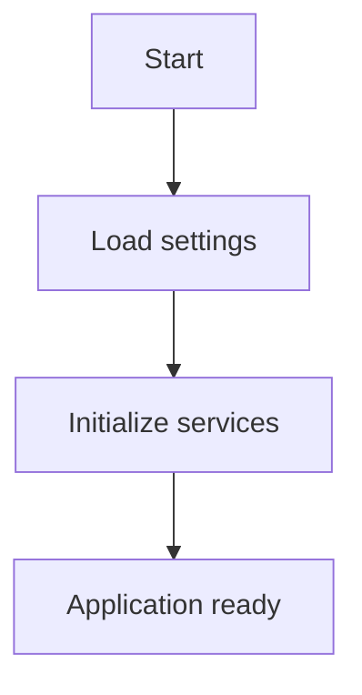
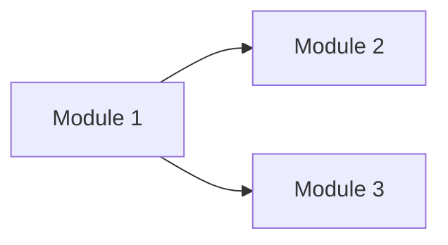
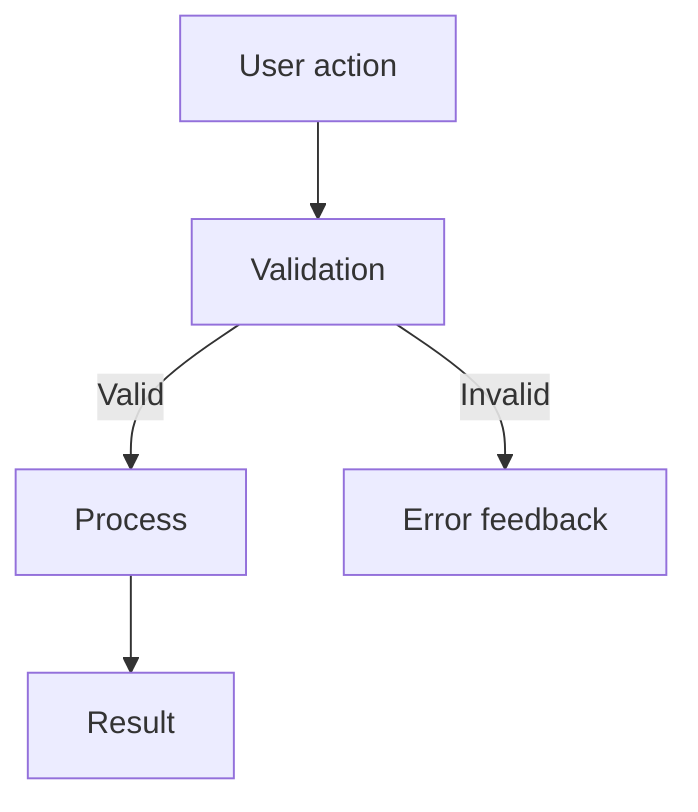
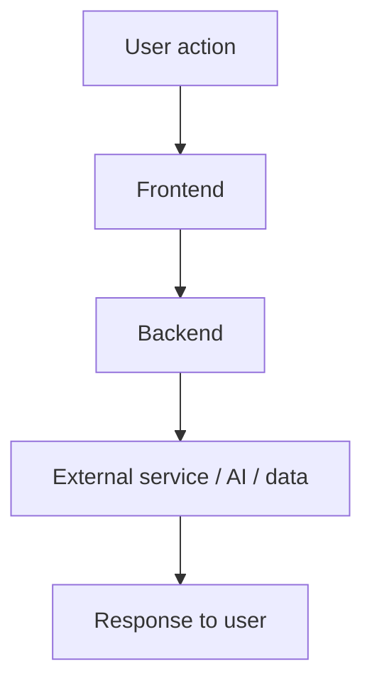
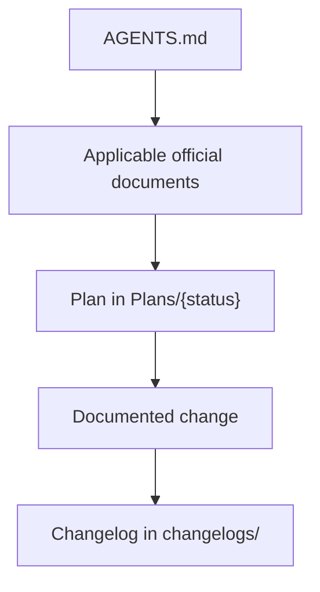

# WORKFLOW.md

Detailed operational document of the application.

> This is a template. Adapt the sections according to the actual architecture of the project. Remove or replace modules that do not exist.

This file describes the functional behavior of each module/screen/service of the application with focus on:

- concept and objective of each area;
- controls and components (buttons, fields, lists, modals, toggles, sliders);
- user events and effects on application state;
- integration between layers (frontend, backend, external services);
- local persistence and processing workflows;
- Mermaid flowcharts of the main paths.

## 1. Overview of Runtime Architecture

### 1.1 `<Layer 1 — e.g., Frontend>`

`<Describe the main process, responsibilities, and memory state.>`

### 1.2 `<Layer 2 — e.g., Backend>`

`<Describe the local/remote service, endpoints, and integrations.>`

### 1.3 Local Persistence

`<Describe configuration files, user data, and vault.>`

## 2. Application Lifecycle

### 2.1 Initialization

`<Describe boot steps: configuration loading, control creation, connection to services.>`

### 2.2 Shutdown

`<Describe shutdown steps: save state, close connections, release resources.>`

## 3. Global Navigation

`<Describe how the user navigates between screens or modules.>`

## 4. Module `<Module Name 1>`

### 4.1 Concept and Objective

`<Describe the purpose of the module.>`

### 4.2 Components

`<List relevant controls, fields, and visual elements.>`

### 4.3 Main Workflow

`<Describe the step-by-step workflow.>`

## 5. Module `<Module Name 2>`

### 5.1 Concept and Objective

`<Describe the purpose of the module.>`

### 5.2 Components

`<List relevant controls, fields, and visual elements.>`

### 5.3 Main Workflow

`<Describe the step-by-step workflow.>`

## 6. Backend / Local Service

`<Remove if there is no separate backend.>`

### 6.1 Security and Middleware

`<Describe token, CORS, and authentication.>`

### 6.2 Main Endpoints

`<List endpoints with method, route, and purpose.>`

| Method | Route | Purpose |
|---|---|---|
| GET | `/health` | Health check |
| `<method>` | `<route>` | `<description>` |

## 7. Integrated Workflow

`<Describe the workflow that connects all layers for the main use case.>`

## 8. Shortcuts and Cross-Cutting Behaviors

`<List keyboard shortcuts, gestures, or behaviors that apply to multiple modules.>`

## 9. Document Governance Workflow

The FrameCode VibeWork framework has its own operational workflow, separate from the application's runtime.

1. `AGENTS.md` guides the initial consultation and points to the applicable official documents.
2. `PLANNING.md` defines the methodology, and each change is recorded in `Plans/{status}`.
3. The implementation or document change updates the affected official documents.
4. `VERSIONING.md` guides the expected version and the corresponding changelog in `changelogs/`.

## 10. Maintenance Observations

`<Record here known maintenance risks, critical dependencies, and areas requiring special attention when making changes.>`

- When evolving the behavior described here, keep this document synchronized within the same change plan/changelog.
